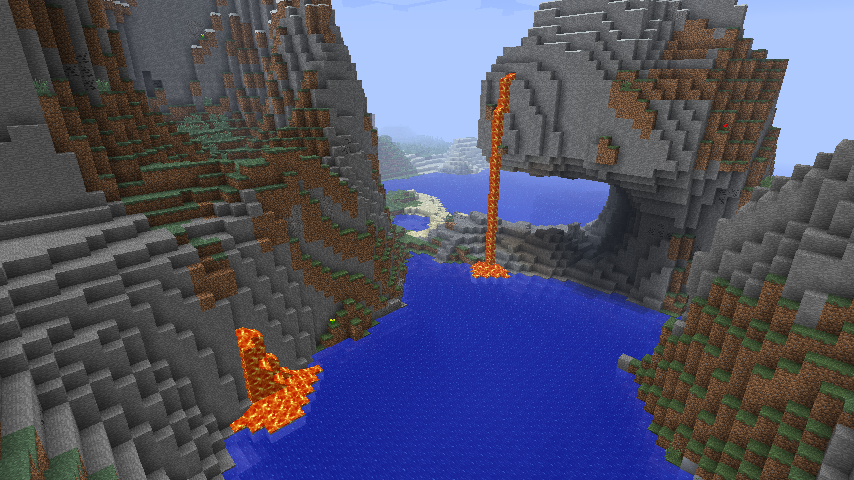

# NostalgicAesthetics for Forge 1.7.10

An attempt to recreate aesthetics of pre-1.7 Minecraft on 1.7.10.

## Requirements

- Forge 1.7.10 10.13.4.1614

## Installation

1. Goto [releases](https://github.com/koyomiji/NostalgicAesthetics/releases) and download the latest jar file.
2. Place the jar file into your `mods` folder.

## License

Apache License 2.0